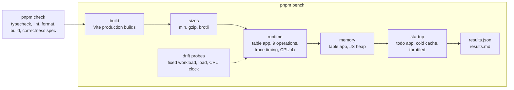

# Gyral benchmarks

The same six apps written in Gyral, React, Preact, Vue, Svelte, Solid and Lit, checked by one
correctness spec, then measured for bundle size, runtime, memory and startup.

[](LICENSE)
[](package.json)
[](https://pnpm.io)
[](results/2026-10-07-full/NOTES.md)
[](docs/apps.md)

- [Why this exists](#why-this-exists)
- [Results, 2026-10-07: Gyral 0.3.0](#results-2026-10-07-gyral-030)
- [How it works](#how-it-works)
- [Run it](#run-it)
- [Conventions](#conventions)
- [Earlier runs](#earlier-runs)

## Why this exists

[Gyral](https://gyral.dev) is a Model-View-Intent framework for web components, and this
repository is its author measuring it against the frameworks people actually choose. Claims
about a framework's size and speed are cheap; this repository makes them checkable, and it
reports the places where Gyral loses as plainly as the places where it wins.

To keep the comparison about the frameworks and not about the app code:

- **The same six apps in every framework** (a floor, a counter, a todo list, a debounced
  search, a signup form and the js-framework-benchmark keyed table), each written the way that
  framework's official documentation recommends. [docs/apps.md](docs/apps.md) lists the idioms
  each one uses.
- **One correctness spec for all of them.** A Playwright spec runs against every production
  build, so a fast but broken implementation can't win.
- **Shared inputs.** Row data, the fake search API and the validation rules are the same code
  for everyone. No UI, state or form libraries.
- **Four measurements:**
  - **Bundle size** of every app: minified, gzip and brotli, plus the framework's floor (an
    app that renders one paragraph).
  - **Runtime:** the nine js-framework-benchmark operations on a keyed table, with in-page
    warm-up, under 4x CPU throttling, 15 interleaved runs each, timed from Chrome performance
    traces with a script / style+layout / paint breakdown.
  - **Memory:** JS heap of the table app after load, with 1,000 rows, and after clearing.
  - **Startup:** the todo app on a cold cache with a throttled network and CPU, until the
    first todo can be added.

What it is not:

- **Not a replacement for [js-framework-benchmark](https://github.com/krausest/js-framework-benchmark).**
  It borrows that project's table operations and its trace-timing rule, but it covers seven
  frameworks rather than dozens, and all of its implementations were written here rather than
  contributed by each framework's own community.
- **One machine.** Headless Chromium on one Linux desktop (an Intel Core i5-10400, 12 threads).
  Absolute numbers will differ on yours; compare frameworks within one run, not across runs.
- **Written by an interested party.** Every implementation follows its framework's documented
  idioms, and none is tuned to move a result, but an expert in any of these frameworks may know
  a better documented way. If you see one, please [open an issue](https://github.com/gyraljs/benchmarks/issues).
- **Client-side rendering only.** Server rendering, hydration and real-world apps are out of
  scope.

## Results, 2026-10-07: Gyral 0.3.0

Gyral 0.3.0 and the published Gyral 0.2.0 against the current releases of the others, all
measured in one run. Full tables: [results.md](results/2026-10-07-full/results.md); noise
analysis and notes: [NOTES.md](results/2026-10-07-full/NOTES.md); every sample is in
`results.json`.

|                                                    | Solid | Preact |  Lit | Svelte | **Gyral 0.3.0** | Gyral 0.2.0 |  Vue | React |
| -------------------------------------------------- | ----: | -----: | ---: | -----: | --------------: | ----------: | ---: | ----: |
| JS, gzip KiB: floor (framework alone)              |   3.7 |    4.7 |  5.8 |    9.0 |        **11.6** |        11.9 | 23.0 |  66.1 |
| JS, gzip KiB: todo app                             |   6.6 |    6.1 |  7.3 |   14.2 |        **13.6** |        13.6 | 25.0 |  66.6 |
| Todo app interactive, cold, throttled (ms, median) |   405 |    396 |  407 |    447 |         **423** |         443 |  502 |   735 |
| Table runtime, geometric mean vs fastest           |  1.08 |   1.38 | 1.31 |   1.07 |        **1.03** |        1.21 | 1.20 |  1.55 |
| Same, without select row                           |  1.10 |   1.25 | 1.27 |   1.02 |        **1.03** |        1.13 | 1.11 |  1.53 |
| JS heap after load (MB)                            |  1.13 |   1.17 | 1.20 |   1.19 |        **1.18** |        1.26 | 1.32 |  1.55 |

Lower is better in every row; a geometric mean of 1.00 would mean fastest at every operation.
Gyral 0.3.0 is the `gyral-next` column in the results files: Gyral's 0.3.0 release packs,
tagged on GitHub but not yet on npm ([why it has its own slot](#gyral-030-is-gyral-next)).

What the numbers say:

- **Runtime: Gyral 0.3.0 has the lowest geometric mean in this run, by a small margin** (1.03;
  Svelte 1.07, Solid 1.08). It is fastest at update every 10th row, remove and clear; Svelte is
  fastest at create, replace, create 10,000 and append. Without select row, Svelte (1.02) and
  Gyral 0.3.0 (1.03) change places. Against 0.2.0 in the same run, no operation is slower:
  seven are faster beyond noise (bootstrap interval and Mann–Whitney test, in the notes; six of
  eight without select), and script time is lower on every operation.
- **Select row is frame-aligned: don't read its −49% against 0.2.0 as a speedup.** Samples are
  bimodal (about 7–10 ms or 15–20 ms), depending on whether a frame was already due when the
  click landed. 12 of 15 Gyral 0.3.0 samples fell in the fast mode, against 3 of 15 for 0.2.0,
  and the split moves between runs for every framework. See
  [the methodology's limits](docs/methodology.md#limits).
- **Size is still Gyral's weak point.** The 0.3.0 floor is 11.6 KiB gzip counting every chunk
  the build emits (0.2.0: 11.9; Lit 5.8, Svelte 9.0). 0.3.0's builds also emit two lazily
  imported chunks (hydration for server-rendered pages, an invoker-commands shim) that a
  client-only page in Chromium did not fetch; the entry chunk alone is 8.6 KiB (computed
  separately, not by the harness). Counting all chunks, the search (+1.0 KiB) and table
  (+0.2 KiB) apps are larger than with 0.2.0.
- **Startup:** the todo app is interactive at 423 ms, 20 ms sooner than with 0.2.0, 16–18 ms
  behind Lit and Solid and 27 ms behind Preact.
- **Memory:** 0.3.0 starts with a smaller heap than 0.2.0 (1.18 vs 1.26 MB) but holds 1,000
  rows in slightly more (2.13 vs 2.05 MB); of the other frameworks, only Lit (1.98) holds them
  in less.
- **Where Gyral 0.3.0 loses:** Svelte is faster at five of the nine operations (create,
  replace, swap, create 10,000, append) and leads without select row; Vue is faster at swap.
  Solid, Preact and Lit ship far less JavaScript and are interactive sooner.

The previous headline, the 2026-10-06 final run (0.3.0-next.6, whose built code is identical
to 0.3.0), gave the same ranking: every geometric mean within 0.02, identical sizes and memory
([comparison in the notes](results/2026-10-07-full/NOTES.md#compared-with-the-2026-10-06-final-run)).

Caveats for this run:

- **Machine:** drift was not flagged (calibration spread 4.1%, limit 5%; 1-minute load 1.3–2.1
  on 12 cores), but the CPU governor was `powersave` (2.4–4.0 GHz between operations).
  Interleaving spreads that over every framework. Two earlier attempts were stopped and
  discarded when another repository's browser tests ran outside the benchmark lock. Compare
  frameworks within this run, not absolute numbers across runs.
- **lit-html is pinned to 3.3.0** for Lit and Gyral 0.2.0 (root `pnpm.overrides`), not the
  current 3.3.3, whose `repeat` leaves an empty comment node behind for every removed item
  ([lit/lit#5010](https://github.com/lit/lit/issues/5010)). In the 2026-10-05 run that made
  "clear 1,000 rows" take about 3.7 s for Lit and Gyral 0.1.0. Gyral 0.3.0 does not use Lit.
- **Gyral 0.3.0 comes from release tarballs, not npm,** until it is published.
- **Runtime is timed from Chrome performance traces,** like js-framework-benchmark
  ([methodology](docs/methodology.md#trace-based-timing-default-since-2026-10-05)), so
  operations shorter than a frame include waiting for the frame that paints them.

### Gyral 0.3.0 is `gyral-next`

`frameworks/gyral-next` is the same six apps on Gyral 0.3's own view layer (no Lit). It
installs `@gyral/core` and `@gyral/time` from tarballs in `vendor-next/` rather than npm, so
0.3 could be measured against the published 0.2.0 (`frameworks/gyral`) in the same run before
it was published. They are Gyral's 0.3.0 release packs (tag `v0.3.0`, commit e79abd6), copied
unchanged; `vendor-next/SOURCE.json` records where they came from. The id stays `gyral-next`
so that old and new results files agree. [CONTRIBUTING.md](CONTRIBUTING.md#measure-an-unreleased-gyral-gyral-next)
explains how to measure another unreleased Gyral, and the plan for when 0.3.0 reaches npm.

## How it works

### Repository layout

```text
shared/src/                  data, fake search API and validation rules every app shares
frameworks/<name>/           one pnpm package per framework: package.json, vite.config.ts
  apps/<app>/                floor, counter, todo, search, form, table
tests/apps.spec.ts           the correctness spec, run against every production build
tests/trace.spec.ts          tests of the trace analysis, and a 20 ms click handler timed to ±2 ms
scripts/                     build, sizes, serve, bench, report, profiling and comparison tools
scripts/lib/                 the measurement code: runtime, trace, memory, startup, drift, stats
results/<date>[-<label>]/    committed runs: results.json (every sample), results.md, NOTES.md
docs/                        methodology, the apps and their contract, profiling
vendor*/                     tarballs installed instead of npm packages (vendor-next/ is Gyral
                             0.3.0; the others are earlier Gyral experiment and RC builds)
```

Besides the seven compared frameworks, `frameworks/` holds Gyral experiment variants
(`gyral-noeffect`, `gyral-twotrack`, `gyral-pipewise`, `gyral-combo`) from earlier runs. They
share Gyral's app sources and are not part of the headline.

### How a run flows



1. **Correctness first.** `pnpm check` builds every app and runs `tests/apps.spec.ts` against
   each production build. Nothing is benchmarked until it passes.
2. **Build and size.** `pnpm bench` builds every app with Vite into `dist/<framework>/<app>/`,
   then compresses each emitted file on its own, as a server would send it.
3. **Runtime.** Each sample opens a fresh page, runs js-framework-benchmark's in-page warm-up,
   forces a garbage collection, throttles the CPU 4x and times one operation with a real mouse
   click, from the click's event dispatch to the paint commit in a Chrome performance trace.
   Rounds interleave the frameworks in shuffled order, so drift during the run spreads over
   all of them.
4. **Memory and startup.** The table app's JS heap after load, with 1,000 rows and after
   clearing; then the todo app in a fresh browser context on a throttled network, until the
   first todo can be added.
5. **Machine state.** A fixed CPU workload, the load average and the CPU clock are probed at
   the start, after every runtime operation and at the end. If the workload's time spreads by
   more than 5%, or the load exceeds half the cores, the run is flagged in `results.md`.
6. **Report.** `results.json` keeps every sample and the run's metadata (commit, machine,
   browser, every framework's installed version); `results.md` is generated from it.

[docs/methodology.md](docs/methodology.md) is the system of record for how each number is
measured: the trace end-point rule and where it differs from js-framework-benchmark, the
validation of the timing, the drift calibration, and the limits of the method. Run notes add
significance tests (a bootstrap interval for the ratio of medians and a Mann–Whitney U test)
where a comparison needs one.

## Run it

You need Node 24 or later, pnpm 10 and a machine that runs Playwright's Chromium. The numbers
in this repository come from Linux, and the lock below uses `flock` (util-linux).

```sh
pnpm install
pnpm exec playwright install chromium
pnpm check           # typecheck, lint, format, build, correctness tests
pnpm bench --quick   # a few samples, to try the harness (results/quick/, not committed)
pnpm bench           # the full run (results/<date>/); ~25 min for the eight compared frameworks
```

| Command                                                | What it does                                                                 |
| ------------------------------------------------------ | ---------------------------------------------------------------------------- |
| `pnpm build [--only=gyral,react]`                      | Production builds → `dist/<framework>/<app>/`                                |
| `pnpm test`                                            | The correctness spec against the current builds (Playwright)                 |
| `pnpm sizes`                                           | Bundle sizes of the current builds                                           |
| `pnpm bench [--quick] [--only=…] [--label=<name>]`     | Build and measure everything → `results/<date>/` or `results/<date>-<name>/` |
| `pnpm bench --strict-drift`                            | Exit with an error if the machine drifted during the run                     |
| `pnpm bench --timing=frame`                            | The older in-page end point instead of trace timing (for comparison runs)    |
| `pnpm report results/<run>`                            | Regenerate a run's `results.md` from its `results.json`                      |
| `pnpm validate:timing`                                 | Check the timing method against a page that busy-waits a known time          |
| `node scripts/rank-compare.mjs <out.md> <old> <new>`   | Per-operation ranks of two runs side by side                                 |
| `node scripts/trace-timeline.mjs [--only=…] [--ops=…]` | The main-thread timeline of a table operation, task by task                  |
| `pnpm profile:build`, `:nodes`, `:run`, `:cpu`         | Profiling variants of the table app ([docs/profile.md](docs/profile.md))     |

Without `--only`, `build` and `bench` cover every package in `frameworks/`, including the
experiment variants. The headline run used
`pnpm bench --label=full --only=gyral,gyral-next,lit,solid,svelte,vue,preact,react`.

**Keep the machine quiet.** Close other browsers and test suites and wait for a low load
average before a timed run. Commands that drive Chromium can share a lock so that two of them
never overlap: `flock /tmp/gyral-bench.lock pnpm bench …`. The lock only works if everything
that drives a browser on the machine takes it; the 2026-10-07 notes describe two attempts that
were discarded because something didn't.

## Conventions

- **Fairness first.** Each implementation follows its framework's official documentation.
  Nobody tunes one framework, or skips a documented best practice in another, to change a
  result. A change needed for one framework only is explained in [docs/apps.md](docs/apps.md).
- **Current npm releases, pinned exactly;** Vite 8 production builds with each framework's
  official plugin and otherwise identical settings. Two exceptions, both stated with the
  results: lit-html is pinned to 3.3.0 for Lit and Gyral 0.2.0 (see the caveats above), and
  Gyral 0.3.0 comes from its vendored release tarballs until it is on npm.
- **Every app passes the correctness spec** before it is benchmarked.
- **Results are committed, never edited.** Each run is one folder and one commit
  (`results: …`); to change a number, re-run and commit a new folder. `pnpm report` can
  regenerate `results.md`, but `results.json` is the record.
- **Results are reported as measured,** including where Gyral loses. Context from elsewhere is
  cited as context, never as a result of this repository.
- **Code:** files of 300 lines or fewer, no `any`, and `pnpm check` passes.

[CONTRIBUTING.md](CONTRIBUTING.md) has the procedures: adding a framework or an app, running
and committing a benchmark, comparing runs, and measuring an unreleased Gyral.

## Earlier runs

Each is comparable only within itself.

- [2026-10-06, Gyral 0.3 final](results/2026-10-06-gyral-0.3-final/NOTES.md): the speed gate
  for Gyral 0.3 (0.3.0-next.6 vs 0.2.0), the previous headline.
- [2026-10-05](results/2026-10-05/results.md): Gyral 0.1.0 on Effect 3 (floor 49.3 KiB gzip),
  lit-html 3.3.3, and the older in-page end point, which often missed the repaint of
  operations shorter than a frame. Gyral's runtime tracked Lit's.
- [2026-10-05, trace-based](results/2026-10-05-lit-html-3.3.0-effect4-trace/NOTES.md): Gyral
  experiment builds (Effect 4, lit-html 3.3.0), the first run with trace timing.
- [2026-10-06, Gyral 0.2.0 confirmation](results/2026-10-06-release-0.2.0-a3/CONFIRMATION.md)
  and [the Gyral 0.3 spike](results/2026-10-06-gyral-next-spike/NOTES.md) (a flagged run,
  under load).

Every run is in [results/](results/).

## License

MIT, © 2026 Mike Zupper; see [LICENSE](LICENSE). Gyral is MIT-licensed as well:
[gyral.dev](https://gyral.dev), [github.com/gyraljs/gyral](https://github.com/gyraljs/gyral).
